# Entity Relationship Diagram (ERD)
## Sistem JDIH Kepulauan Riau

### Diagram ERD

```mermaid
erDiagram
    %% Core Entities
    users ||--o{ documents : creates
    users ||--o{ document_versions : creates
    users ||--o{ comments : writes
    users ||--o{ audit_logs : generates
    users ||--o{ notifications : receives
    users ||--o{ user_activities : performs
    users }|--|| roles : has
    users ||--o{ bookmarks : creates
    users ||--o{ reading_history : tracks
    
    roles ||--o{ role_permissions : has
    permissions ||--o{ role_permissions : granted_to
    
    %% Document Management
    documents ||--o{ document_versions : has
    documents ||--o{ document_relations : source
    documents ||--o{ document_relations : target
    documents }|--|| document_types : belongs_to
    documents }|--|| categories : in
    documents }|--|| status : has
    documents ||--o{ document_tags : tagged_with
    documents ||--o{ document_attachments : has
    documents ||--o{ comments : discussed_in
    documents ||--o{ document_statistics : tracks
    documents ||--o{ bookmarks : bookmarked_by
    documents ||--o{ reading_history : read_by
    
    tags ||--o{ document_tags : used_in
    
    %% Workflow System
    documents ||--o{ workflow_instances : follows
    workflow_templates ||--o{ workflow_instances : instantiated
    workflow_templates ||--o{ workflow_steps : contains
    workflow_instances ||--o{ workflow_step_instances : has
    workflow_steps ||--o{ workflow_step_instances : instantiated
    workflow_step_instances ||--o{ workflow_approvals : requires
    users ||--o{ workflow_approvals : approves
    
    %% Advanced Search
    documents ||--o{ document_search_index : indexed
    search_queries ||--o{ search_query_logs : logged
    users ||--o{ search_query_logs : performs
    
    %% Analytics
    documents ||--o{ document_analytics : analyzed
    users ||--o{ user_analytics : analyzed
    
    %% Integration
    documents ||--o{ api_requests : accessed_via
    users ||--o{ api_keys : owns
    
    %% Entities Definition
    
    users {
        uuid id PK
        string username UK
        string email UK
        string password_hash
        string full_name
        string nip
        uuid role_id FK
        string phone
        string avatar_url
        boolean is_active
        timestamp email_verified_at
        timestamp last_login_at
        jsonb preferences
        timestamp created_at
        timestamp updated_at
        timestamp deleted_at
    }
    
    roles {
        uuid id PK
        string name UK
        string display_name
        text description
        int level
        boolean is_system
        jsonb permissions_cache
        timestamp created_at
        timestamp updated_at
    }
    
    permissions {
        uuid id PK
        string name UK
        string display_name
        string module
        text description
        timestamp created_at
    }
    
    role_permissions {
        uuid id PK
        uuid role_id FK
        uuid permission_id FK
        timestamp granted_at
        uuid granted_by FK
    }
    
    documents {
        uuid id PK
        string doc_number UK
        string title
        text abstract
        uuid type_id FK
        uuid category_id FK
        uuid status_id FK
        date published_date
        date effective_date
        string issuing_institution
        string signer_name
        string signer_title
        text source
        text notes
        int view_count
        int download_count
        uuid created_by FK
        uuid updated_by FK
        uuid approved_by FK
        timestamp approved_at
        boolean is_featured
        boolean is_archived
        jsonb metadata
        tsvector search_vector
        timestamp created_at
        timestamp updated_at
        timestamp deleted_at
    }
    
    document_types {
        uuid id PK
        string code UK
        string name
        text description
        string icon
        int sort_order
        boolean is_active
        jsonb validation_rules
        timestamp created_at
        timestamp updated_at
    }
    
    categories {
        uuid id PK
        string code UK
        string name
        text description
        uuid parent_id FK
        string path
        int level
        int sort_order
        boolean is_active
        timestamp created_at
        timestamp updated_at
    }
    
    status {
        uuid id PK
        string code UK
        string name
        string color
        text description
        int sort_order
        boolean is_active
        timestamp created_at
    }
    
    document_versions {
        uuid id PK
        uuid document_id FK
        int version_number
        string title
        text change_summary
        text content
        string file_path
        string file_name
        bigint file_size
        string mime_type
        string checksum
        uuid created_by FK
        jsonb metadata
        timestamp created_at
    }
    
    document_relations {
        uuid id PK
        uuid source_document_id FK
        uuid target_document_id FK
        string relation_type
        text description
        uuid created_by FK
        timestamp created_at
    }
    
    tags {
        uuid id PK
        string name UK
        string slug UK
        text description
        int usage_count
        timestamp created_at
        timestamp updated_at
    }
    
    document_tags {
        uuid id PK
        uuid document_id FK
        uuid tag_id FK
        uuid created_by FK
        timestamp created_at
    }
    
    document_attachments {
        uuid id PK
        uuid document_id FK
        string file_name
        string file_path
        bigint file_size
        string mime_type
        string type
        text description
        int sort_order
        uuid uploaded_by FK
        timestamp created_at
    }
    
    comments {
        uuid id PK
        uuid document_id FK
        uuid parent_id FK
        uuid user_id FK
        text content
        boolean is_internal
        boolean is_approved
        uuid approved_by FK
        timestamp approved_at
        timestamp created_at
        timestamp updated_at
        timestamp deleted_at
    }
    
    workflow_templates {
        uuid id PK
        string name UK
        text description
        uuid document_type_id FK
        boolean is_active
        boolean is_default
        jsonb config
        uuid created_by FK
        timestamp created_at
        timestamp updated_at
    }
    
    workflow_steps {
        uuid id PK
        uuid template_id FK
        string name
        text description
        int step_order
        string step_type
        uuid role_id FK
        int required_approvals
        int timeout_hours
        jsonb conditions
        jsonb actions
        timestamp created_at
        timestamp updated_at
    }
    
    workflow_instances {
        uuid id PK
        uuid document_id FK
        uuid template_id FK
        string status
        uuid current_step_id FK
        uuid initiated_by FK
        timestamp initiated_at
        timestamp completed_at
        jsonb metadata
        timestamp created_at
        timestamp updated_at
    }
    
    workflow_step_instances {
        uuid id PK
        uuid workflow_instance_id FK
        uuid workflow_step_id FK
        int step_order
        string status
        timestamp started_at
        timestamp completed_at
        timestamp deadline_at
        jsonb data
        timestamp created_at
        timestamp updated_at
    }
    
    workflow_approvals {
        uuid id PK
        uuid step_instance_id FK
        uuid user_id FK
        string action
        text comment
        jsonb data
        timestamp approved_at
        timestamp created_at
    }
    
    document_statistics {
        uuid id PK
        uuid document_id FK
        date stat_date
        int views
        int downloads
        int shares
        int bookmarks
        jsonb details
        timestamp created_at
        timestamp updated_at
    }
    
    document_search_index {
        uuid id PK
        uuid document_id FK
        tsvector search_vector
        jsonb indexed_fields
        timestamp indexed_at
    }
    
    search_queries {
        uuid id PK
        string query_text UK
        int search_count
        timestamp last_searched_at
        timestamp created_at
    }
    
    search_query_logs {
        uuid id PK
        uuid user_id FK
        uuid search_query_id FK
        string query_text
        jsonb filters
        int results_count
        timestamp searched_at
    }
    
    bookmarks {
        uuid id PK
        uuid user_id FK
        uuid document_id FK
        text notes
        timestamp created_at
    }
    
    reading_history {
        uuid id PK
        uuid user_id FK
        uuid document_id FK
        int duration_seconds
        int progress_percentage
        timestamp read_at
    }
    
    user_activities {
        uuid id PK
        uuid user_id FK
        string activity_type
        string entity_type
        uuid entity_id
        jsonb data
        string ip_address
        string user_agent
        timestamp created_at
    }
    
    audit_logs {
        uuid id PK
        uuid user_id FK
        string action
        string entity_type
        uuid entity_id
        jsonb old_values
        jsonb new_values
        string ip_address
        string user_agent
        timestamp created_at
    }
    
    notifications {
        uuid id PK
        uuid user_id FK
        string type
        string title
        text message
        jsonb data
        boolean is_read
        timestamp read_at
        timestamp created_at
    }
    
    document_analytics {
        uuid id PK
        uuid document_id FK
        date analytics_date
        int unique_visitors
        int total_views
        int downloads
        int avg_read_duration
        jsonb traffic_sources
        jsonb user_demographics
        timestamp created_at
        timestamp updated_at
    }
    
    user_analytics {
        uuid id PK
        uuid user_id FK
        date analytics_date
        int documents_viewed
        int documents_downloaded
        int searches_performed
        int comments_posted
        int time_spent_minutes
        jsonb activity_breakdown
        timestamp created_at
        timestamp updated_at
    }
    
    api_keys {
        uuid id PK
        uuid user_id FK
        string key_hash UK
        string name
        text description
        jsonb permissions
        timestamp last_used_at
        timestamp expires_at
        boolean is_active
        timestamp created_at
        timestamp updated_at
    }
    
    api_requests {
        uuid id PK
        uuid api_key_id FK
        uuid document_id FK
        string endpoint
        string method
        int response_code
        int response_time_ms
        string ip_address
        timestamp created_at
    }
```



### Penjelasan Relasi

#### 1. User Management
- **users ↔ roles**: Many-to-One (Setiap user memiliki satu role)
- **roles ↔ permissions**: Many-to-Many melalui `role_permissions`
- **users ↔ documents**: One-to-Many (User membuat banyak dokumen)

#### 2. Document Management
- **documents ↔ document_types**: Many-to-One (Dokumen memiliki satu tipe)
- **documents ↔ categories**: Many-to-One (Dokumen dalam satu kategori)
- **documents ↔ status**: Many-to-One (Dokumen memiliki satu status)
- **documents ↔ document_versions**: One-to-Many (Dokumen memiliki banyak versi)
- **documents ↔ tags**: Many-to-Many melalui `document_tags`
- **documents ↔ document_relations**: Self-referencing Many-to-Many (Dokumen terkait dokumen lain)

#### 3. Workflow System
- **workflow_templates ↔ workflow_steps**: One-to-Many (Template memiliki banyak step)
- **documents ↔ workflow_instances**: One-to-Many (Dokumen memiliki banyak workflow instance)
- **workflow_instances ↔ workflow_step_instances**: One-to-Many
- **workflow_step_instances ↔ workflow_approvals**: One-to-Many

#### 4. Search & Analytics
- **documents ↔ document_search_index**: One-to-One (Untuk full-text search)
- **documents ↔ document_analytics**: One-to-Many (Tracking analytics per hari)
- **users ↔ user_analytics**: One-to-Many (Tracking analytics per hari)

#### 5. User Interaction
- **users ↔ bookmarks ↔ documents**: Many-to-Many (User bookmark dokumen)
- **users ↔ reading_history ↔ documents**: Many-to-Many (User membaca dokumen)
- **users ↔ comments ↔ documents**: Many-to-Many (User komentar pada dokumen)

### Indeks Penting

```sql
-- User indexes
CREATE INDEX idx_users_email ON users(email);
CREATE INDEX idx_users_username ON users(username);
CREATE INDEX idx_users_role_id ON users(role_id);

-- Document indexes
CREATE INDEX idx_documents_type_id ON documents(type_id);
CREATE INDEX idx_documents_category_id ON documents(category_id);
CREATE INDEX idx_documents_status_id ON documents(status_id);
CREATE INDEX idx_documents_created_by ON documents(created_by);
CREATE INDEX idx_documents_published_date ON documents(published_date);
CREATE INDEX idx_documents_search_vector ON documents USING gin(search_vector);

-- Version indexes
CREATE INDEX idx_document_versions_document_id ON document_versions(document_id);
CREATE INDEX idx_document_versions_version_number ON document_versions(document_id, version_number);

-- Workflow indexes
CREATE INDEX idx_workflow_instances_document_id ON workflow_instances(document_id);
CREATE INDEX idx_workflow_instances_status ON workflow_instances(status);
CREATE INDEX idx_workflow_step_instances_workflow_instance_id ON workflow_step_instances(workflow_instance_id);

-- Analytics indexes
CREATE INDEX idx_document_statistics_document_id ON document_statistics(document_id);
CREATE INDEX idx_document_statistics_stat_date ON document_statistics(stat_date);
CREATE INDEX idx_document_analytics_document_id ON document_analytics(document_id);
CREATE INDEX idx_document_analytics_date ON document_analytics(analytics_date);

-- Search indexes
CREATE INDEX idx_search_query_logs_user_id ON search_query_logs(user_id);
CREATE INDEX idx_search_query_logs_searched_at ON search_query_logs(searched_at);

-- Activity indexes
CREATE INDEX idx_user_activities_user_id ON user_activities(user_id);
CREATE INDEX idx_user_activities_created_at ON user_activities(created_at);
CREATE INDEX idx_audit_logs_user_id ON audit_logs(user_id);
CREATE INDEX idx_audit_logs_entity ON audit_logs(entity_type, entity_id);
```

### Constraint Penting

```sql
-- Unique constraints
ALTER TABLE users ADD CONSTRAINT uk_users_email UNIQUE (email);
ALTER TABLE users ADD CONSTRAINT uk_users_username UNIQUE (username);
ALTER TABLE documents ADD CONSTRAINT uk_documents_doc_number UNIQUE (doc_number);
ALTER TABLE roles ADD CONSTRAINT uk_roles_name UNIQUE (name);
ALTER TABLE permissions ADD CONSTRAINT uk_permissions_name UNIQUE (name);

-- Foreign key constraints with cascading
ALTER TABLE documents 
  ADD CONSTRAINT fk_documents_created_by 
  FOREIGN KEY (created_by) REFERENCES users(id) ON DELETE SET NULL;

ALTER TABLE document_versions 
  ADD CONSTRAINT fk_document_versions_document_id 
  FOREIGN KEY (document_id) REFERENCES documents(id) ON DELETE CASCADE;

ALTER TABLE workflow_instances 
  ADD CONSTRAINT fk_workflow_instances_document_id 
  FOREIGN KEY (document_id) REFERENCES documents(id) ON DELETE CASCADE;

-- Check constraints
ALTER TABLE document_versions 
  ADD CONSTRAINT chk_version_number_positive 
  CHECK (version_number > 0);

ALTER TABLE workflow_steps 
  ADD CONSTRAINT chk_step_order_positive 
  CHECK (step_order > 0);

ALTER TABLE document_statistics 
  ADD CONSTRAINT chk_statistics_non_negative 
  CHECK (views >= 0 AND downloads >= 0);
```

### Catatan Implementasi

1. **UUID sebagai Primary Key**: Semua tabel menggunakan UUID untuk menghindari collision dan meningkatkan keamanan
2. **Soft Delete**: Beberapa tabel menggunakan `deleted_at` untuk soft delete
3. **JSONB Fields**: Digunakan untuk fleksibilitas data yang sering berubah
4. **Full-Text Search**: Menggunakan `tsvector` PostgreSQL untuk pencarian cepat
5. **Audit Trail**: Lengkap dengan `audit_logs` dan `user_activities`
6. **Timestamp**: Semua tabel memiliki `created_at` dan beberapa dengan `updated_at`

### Optimisasi

1. **Partitioning**: Pertimbangkan partisi untuk tabel besar seperti:
   - `document_analytics` (by date)
   - `user_activities` (by date)
   - `audit_logs` (by date)
   - `search_query_logs` (by date)

2. **Materialized Views**: Untuk query analytics yang kompleks
3. **Connection Pooling**: Gunakan PgBouncer atau sejenisnya
4. **Read Replicas**: Untuk load balancing query read-heavy
5. **Caching**: Redis untuk frequently accessed data
